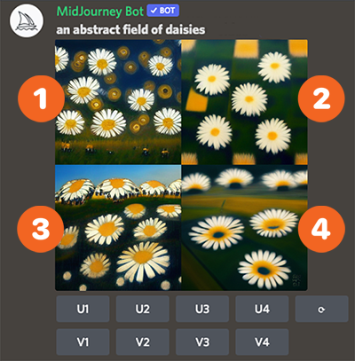

# Quick Start Guide

Midjourney is a new research lab focused on new mediums and tools for empowering people. There are two ways to experience the tools:&#x20;

1. The Discord server at [https://discord.gg/midjourney](https://discord.gg/midjourney), where you will generate images.&#x20;
2. The web app at [https://www.midjourney.com/](https://www.midjourney.com/app/), where you will find a gallery of your own work and browse other users' creations.

Table of Contents:

* [Code of Conduct](./#code-of-conduct)
* [Create your First Image](./#create-your-first-image)
  * [1. Select one of the `#newbies` channels from the sidebar](./#1.-select-one-of-the-newbies-channels-from-the-sidebar)
  * [2. Use the /imagine Command](./#2.-use-the-imagine-command)
  * [3. Wait as the MidJourney Bot Processes Your Request](./#3.-wait-as-the-midjourney-bot-processes-your-request)
  * [4. Upscale your Image or Create Variations](./#4.-upscale-your-image-or-create-variations)&#x20;
  * [5. Save Your Image](./#5.-save-your-image)
  * [6. Send Results to Your DMs (Direct Messages)](./#6.-send-results-to-your-dms-direct-messages)
  * [7. Become a Paid Subscriber if you Want to Generate More](./#7.-become-a-paid-subscriber-if-you-want-to-generate-more)
  * [8. As a Subscriber, DM the Bot If You Want Less Noise Around](./#8.-as-a-subscriber-dm-the-bot-if-you-want-less-noise-around)
* [Any Questions?](./#any-questions)

## Code of Conduct

* Don't be a jerk.
* Don't use our tools to make images that could inflame, upset, or cause drama. That includes gore and adult content.
* Be respectful to other people and the team.

Make sure you are familiar with the [Full Content Guidelines](content-and-moderation-policy.md).

You can also find more detail within the Midjourney Discord server in the `#rules`, `#faq`, `#announcements`, and `#status` channels.

## Create your First Image

Before starting, join our Discord server with this link: [https://discord.gg/midjourney](https://discord.gg/midjourney)&#x20;

Once you have joined the Discord server you will be able to create a limited number of images before needing to subscribe. You will have around 25 free uses of the `/imagine` command. These uses are also known as "queries", "jobs", or "GPU minutes".

### 1. Select one of the `#newbies` channels from the sidebar

### 2. Use the /imagine Command

To use the MidJourney Bot, use a [Discord Slash Command](https://support.discord.com/hc/en-us/articles/1500000368501-Slash-Commands-FAQ) in a Bot channel, like #newbies-1. Start typing `/imagine` and you will notice something pop up above your text.&#x20;

**Click or tap on the `/imagine` option**: the `prompt` field will be created and now you can add whatever you want the bot to generate, as you can see in the video below. Make sure to respect our [Content and Moderation policy](content-and-moderation-policy.md): keep it PG-13 and avoid upsetting imagery.

You can also try to press the Spacebar, Tab, or Enter to create the `prompt` field. Bot slash commands will only work in Bot channels. Typing `/imagine` will not work in regular channels, such as `#trial-support`.

Once you're satisfied with the prompt you just wrote, press Enter or send your message. That will deliver your request to the MidJourney Bot, which will soon start generating your images.

### 3. Wait as the MidJourney Bot Processes Your Request

Requests take a minute to generate four options based on your prompt.

### 4. Upscale Your Image or Create Variations

After a 2x2 grid of images has finished generating, two rows of buttons will appear:&#x20;

* In the top row: `U1`, `U2`, `U3`, and `U4` are buttons for **Upscaling** your chosen image. Upscaling an image generates a larger roughly 1024x1024 pixel version of the selected image. By default, this will also generate additional details.
* In the bottom row: `V1`, `U2`, `V3`, and `V4` are buttons for creating **Variations** of your chosen image. Creating variations will generate four new images, similar in overall style and composition to the image you selected.

After you use a `U` button to upscale, you will have a few more options:

* `Make Variations` does the same as the `V` buttons, generating new alternatives in a grid.
* `Upscale to Max` upscales the image to an even larger resolution of roughly 1664x1664.
* `Light Upscale Redo` upscales again, starting over, without adding as much detail.


Using these buttons will also use some of your 25 free jobs. To check how many uses you have left, use the `/info` command in the same way you used `/imagine`.


### 5. Save Your Image

You can click on the image to open it to full size, and then right-click and choose `Save image` to save it to your local computer. If you're on mobile, you can tap the image and then tap the download icon (:inbox\_tray:) in the top right corner.

Your upscaled image (and 2x2 grid images) will immediately be visible on your website gallery at [midjourney.com/app](https://www.midjourney.com/app/) (you need to `Sign In with Discord` first.

### 6. Send Results to Your DMs (Direct Messages)

You can ask the MidJourney Bot to send you a Discord direct message containing your final results. To do so, react with the envelope emoji (:envelope:) to one of the bot's messages that contains a finished generation. This works with both single upscaled images and 2x2 grids, as shown below.

### 7. Become a Paid Subscriber if you Want to Generate More

Your 25 free jobs do not presently expire but will also not renew. Once you have used all of them, you can use `/subscribe` in any bot channel to purchase a membership. Follow the link MidJourney generates to go to your subscription page.

For prices and more information, you can visit [Billing and Licensing](billing.md).

### 8. As a Subscriber, DM the Bot If You Want Less Noise Around

If you are a paid subscriber, you can also use [the bot in your Direct Messages](FAQs.md#dming-the-bot-direct-messaging) instead of in a public bot channel. This will still be subject to content rules and generate images that will be visible in your gallery on the website.&#x20;

## Any Questions?

If you still have questions or doubts, these pages can also be helpful:

* [The User Manual](user-manual.md), to learn how to unlock MidJourney's full potential.
* [Resource Links](resource-links/), for tips, tricks, and experiments by our community of creatives.
* [Copyright and Trademark](https://midjourney.gitbook.io/docs/terms-of-service#4.-copyright-and-trademark), to see what you are allowed to do with the images you generate. If you're a paid subscriber, they may be yours to do as you please, even commercially.

Don't forget about our Discord server:

* The `#rules` and `#faq` channels contain more information about our services.
* In `#announcements` and `#status` you will find all important updates and news.
* `#micro-polls` is where we ask about your preferences and experiences with our tools.
* Still need help? Ask your question in either `#trial-support` or `#member-support`.&#x20;
