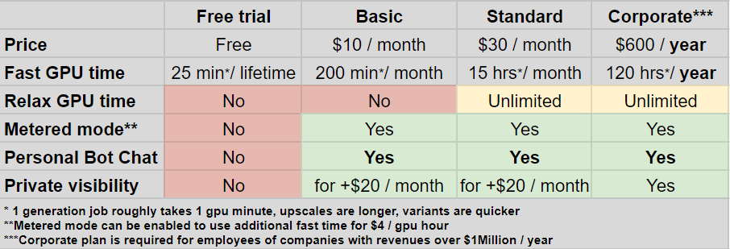

# Billing and Licensing

* [Subscription, Billing, and Licensing Questions](billing.md#subscription-billing-and-licensing-questions)
  * [How to Subscribe](billing.md#how-to-subscribe)
  * [Plans](billing.md#plans)
    * [Both Basic and Standard Plans offer:](billing.md#both-basic-and-standard-plans-offer)
    * [Basic Membership ($10/month) offers:](billing.md#basic-membership-usd10-month-offers)
    * [Standard Membership ($30/month) offers:](billing.md#standard-membership-usd30-month-offers)
    * [Private Visibility Option (+$20/month)](billing.md#private-power-option)
    * [Incremental Billing ($4 for 60 GPU minutes)](billing.md#incremental-billing)
    * [Corporate Membership ($600/year) offers:](billing.md#corporate-membership-usd600-year-offers)
  * [Commercial Terms](billing.md#commercial-terms)
  * [Cancellation or Changes](billing.md#cancellation-or-changes)

## How to Subscribe

Type /subscribe in any bot channel to upgrade or purchase. Follow the link Midjourney generates to take you to your subscription page.

&#x20;

Another way is to follow that link and login with your Discord credentials at [https://www.midjourney.com/account/](https://www.midjourney.com/account/).

#### What payment options do you accept?

We only accept debit and credit cards issued by services like VISA, Mastercard, American Express, Discover & Diners, and Japan Credit Bureau. This is because we currently process all payments through Stripe, a payment processing service certified to PCI Service Provider Level 1. This is the most stringent level of certification available in the payments industry.

PayPal, wire transfer, and similar methods are not currently supported.

## Plans

There are 2 mainstream plans: Basic for $10/month and Standard for $30/month. Standard benefits from having access to 'relax' time and more than 4 times as much 'fast' time: [go here to learn more about 'fast' and 'relax' time](https://midjourney.gitbook.io/docs/faqs#fast-and-relaxed). Both can add the Private visibility option for $20/month.&#x20;

Are you using MidJourney as an employee for a company with over $1Million/year in gross revenue? If so, you need to choose the Corporate plan for $600/year. This plan is similar to a yearly version of Standard+Private with reduced fast hours and a license to allow use at large companies.

### Both Basic and Standard Plans offer:

* Monthly subscription. Will renew automatically after 30 days by default (which can be toggled off)
* The ability to DM (Direct Message) the MidJourney Bot (your images will still appear in the public gallery unless you add `/private` to your subscription).
* The ability to purchase private-by-default mode by using the `/private` command on Discord and adding $20/month to your subscription. Private images will still be on your gallery on the website, except they're hidden from other users and they'll remain hidden even after you discontinue private mode.
* Fast mode. You can buy more 'fast' minutes for $4/60min by turning on metered incremental billing (use `/fast` to purchase fast hours).
* Once you've successfully upgraded you'll see a new "basic member" or "member" role on your Discord profile, which will give you access to all of our community channels.
* Access to community feeds and galleries at [midjourney.com](https://www.midjourney.com/app/feed/all/).
* Restricted commercial usage; [learn more about it here](https://midjourney.gitbook.io/docs/terms-of-service#4.-copyright-and-trademark).&#x20;

### Basic Membership ($10/month) offers:

* You'll be able to run \~200 jobs every month. To be more specific, your available ['fast' time](https://midjourney.gitbook.io/docs/faqs#fast-and-relaxed) is set to 200 GPU minutes every time you purchase or renew this plan.
* No access to relax mode
* You can upgrade your plan at any time under `/subscribe`. You will receive a discount proportional to the GPU minutes you haven't used. For example, you'll receive a $5 discount if you used 100 out of your 200 minutes.

### Standard Membership ($30/month) offers:

* Your available ['fast' time](https://midjourney.gitbook.io/docs/faqs#fast-and-relaxed) is set to 15 GPU hours (900 GPU minutes) every time you purchase or renew this plan. This is 4.5 times as much GPU time when compared to Basic.
* You now have access to 'relax' mode, which allows you to run unlimited jobs in exchange for longer wait times. While in 'relax' mode, you won't be able to run 'Upscale to Max' jobs.
* 'Fast' mode is enabled by default for new subscribers but you can switch between 'relax' or 'fast' at any time by using the `/settings` command.

### Private Visibility Option (+$20/month)

* All plans can work in Direct Messages (DMs) with the MidJourney Bot. With Private visibility, private images on your gallery on the website will be hidden from other users and they'll remain hidden even after you discontinue private mode.
* Private mode is still subject to the PG-13 rules of content generation, however.&#x20;
* While paying for Private visibility, you'll also be able to publish or unpublish images in your gallery through :eye:-shaped buttons. If you don't see them, you will need to log out from the website and then log back in.&#x20;

### Incremental Billing ($4 for 60 GPU minutes)

* All paid plans can purchase more 'fast' minutes with incremental billing, which is also known as metered fast time. Once you have exhausted the 'fast' time on your plan, you'll be given the option to activate incremental billing at a rate of $4 per GPU hour. You can use the `/fast` command to have this option appear once again.
* Before activating fast time you have to set a '**spending limit**'. When you hit the spending limit, MidJourney will stop you and ask you to set a new one before continuing.
* You will only be charged for the time you've actually used. For example, if you set a spending limit of $20 but you only use $17.32 in metered GPU minutes, you'll only be billed for $17.32.
* You can use `/info` at any time to see how many metered fast minutes you've used, along with their cost in USD.
* Incremental billing will be charged either at the end of the month for your subscription or every time you hit the billing threshold. This threshold is equal to the renewal price of your current plan, such as $30 for the Standard plan.

### Corporate Membership ($600/year) offers:

* You will be able to use images commercially as an employee for a company with over $1Million/year in gross revenue.
* Your available ['fast' time](https://midjourney.gitbook.io/docs/faqs#fast-and-relaxed) is set to 120 GPU hours (7,200 GPU minutes) every time you purchase or renew this plan. This is 2/3rds as much GPU time when compared to a full year of Standard.&#x20;
* All the same features as the Standard Membership plan.
* All the same features as the Private visibility Option, at no additional cost.

## Commercial Terms

You basically own all Assets you create using Midjourney’s image generation and chat services. This does not apply if you fall under the exceptions below. See [Terms of Service](terms-of-service.md) for full details.

1.  _**Exception 1: Non-Paid Members License Terms**_

    If you are not a Paid Member, Midjourney grants you a license to the Assets under the Creative Commons Noncommercial 4.0 Attribution International License (the “Asset License”).

    The full text is accessible as of the Effective Date here: [https://creativecommons.org/licenses/by-nc/4.0/legalcode](https://creativecommons.org/licenses/by-nc/4.0/legalcode).
2.  _**Exception 2: Corporate-User License Terms**_

    If you are an employee or owner of a company with more than $1,000,000 USD a year in gross revenue, and you are using the Services to benefit your Employer or company you must purchase a corporate membership plan to use the Services or copy the Assets for your company. Corporate membership plans involve an upfront, non-refundable deposit for up to 12 months of service.

Please note: These terms are not definitive and we will continue to iterate on them as the beta progresses.&#x20;

Please note: Midjourney is an open community which allows others to use and remix your images and prompts whenever they are posted in a public setting. By default, your images are publically viewable and remixable. As described above, you grant Midjourney a license to allow this.  If you purchase a private plan, you may bypass some of these public sharing defaults.

## Cancellation or Changes

#### **Can I cancel my subscription plan?**

You can cancel your subscription at any time: the cancellation will be effective at the end of the current billing cycle and you'll still be able to use your current subscription until then. If you change your mind, you can un-cancel your plan before the end of the cycle. To cancel your subscription, go to the same page you bought it from: [https://www.midjourney.com/account/](https://www.midjourney.com/account/).

#### Can you refund my active subscription plan?&#x20;

If you cancel your plan while having run jobs for less than 1% of your subscription's fast time for the month, you'll also be eligible for a refund.

#### **Can I change my subscription plan?**

You can generally change your subscription at any time, effective immediately. Any remaining usage of Private visibility will be credited to your new plan. Enterprise plans, such as Corporate, are not eligible for downgrades. To change your subscription, go to the same page you bought it from: [https://www.midjourney.com/account/](https://www.midjourney.com/account/).
