# Imagine Parameters Illustrated

### Basic Structure

Parameters options that change how the images generate. A full `/imagine` command might contain several things, like an image URL, image weights, algorithm versions, and other switches. \
\
`/imagine` parameters should follow the below order:

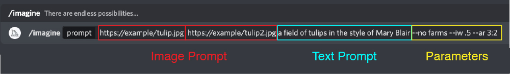

"Switches" in this context means controls passed to the bot using a "--" parameter.  For instance, the command `/imagine hi there --w 448` has a text prompt, and a parameter for the width, using the "--w" instruction.\
\


### Sizes

#### **Width and Height**&#x20;

`--w` Width of image. Works better as multiple of 64 (or 128 for `--hd`)

`--h` Height of image. Works better as multiple of 64 (or 128 for `--hd`)

`--w` and `--h` values above 512 are unstable and may cause errors.

&#x20;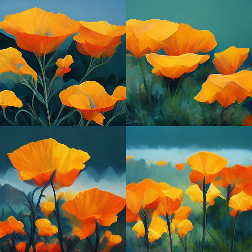 ****&#x20;

**/imagine:** `prompt`**`vibrant california poppies`**

``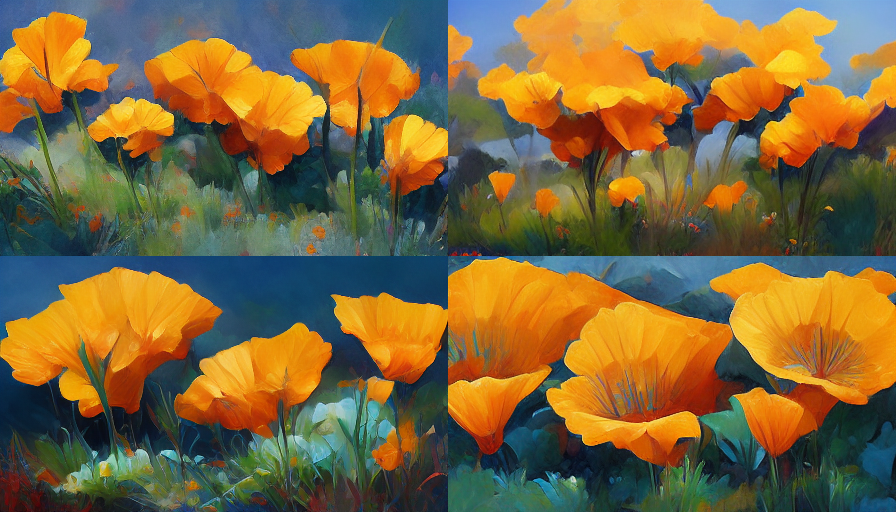``

**/imagine:**`prompt`**`vibrant california poppies --w 448`**

**``**

`--aspect`  or `--ar` Sets a desired aspect ratio, instead of manually setting height and width with `--h` and `--w`. &#x20;

Try `--ar 16:9` for example, to get a 9:16 aspect ratio (\~256x448).

&#x20;`prompt`**`vibrant california poppies --ar 9:16`**

Also see [Understanding Image Sizes](resource-links/understanding-image-size.md).

#### Size Shortcuts

These "shortcuts" are command that do the same as the forms following the ":" in the list below.  For instance, if you type:

**/imagine:** `prompt`**`vibrant california poppies`**`--wallpaper`

It would be the same as typing the longer form:

**/imagine:** `prompt`**`vibrant california poppies`**`--w 1920 --h 1024 --hd`

``

Shortcut equivalences:

`--wallpaper`: `--w 1920 --h 1024 --hd`

`--sl`: `--w 320 --h 256`

`--ml`: `--w 448 --h 320`

`--ll`: `--w 768 --h 512 --hd`

`--sp`: `--w 256 --h 320`

`--mp`: `--w 320 --h 448`

`--lp`: `--w 512 --h 768 --hd`

###

### Algorithm Modifiers

#### Version 1

`--version 1` or `--v 1` uses the original Midjourney algorithm (more abstract, sometimes better for macro or textures). `--v 1` corresponds to the button in `/settings.`

``.png>) prompt: **`vibrant california poppies` --version 1**

#### Version **2**

`--version 2` or `--v 2` uses the original Midjourney algorithm in use before July 25th, 2022. \
`--v 2` corresponds to the 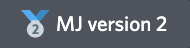button in `/settings.`

.png>) prompt: **`vibrant california poppies` --v 2**

#### Version **3**

`--version 3` or `--v 3` uses the current default Midjourney algorithm. \
`--v 3` corresponds to the 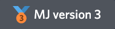 button in `/settings.`

``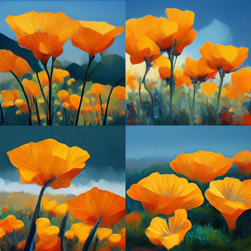 prompt: **`vibrant california poppies --v 3`**

#### High Definition

`--hd` Uses a different algorithm that’s potentially better for larger images, but with less consistent compositions.&#x20;

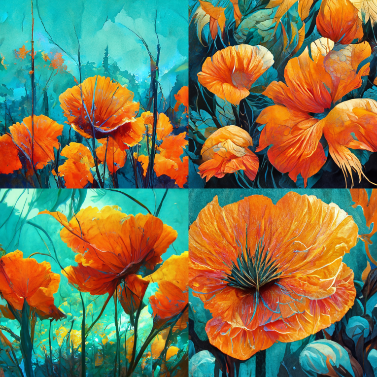prompt: **`vibrant california poppies --hd`**


### Prompt Modifiers

#### --No

`--no` Negative prompting (e.g., `--no plants` would try to remove plants).  This is like giving it a weight of -0.5.

&#x20;.png>) prompt: **`vibrant california poppies --no grass` **&#x20;


### Detail Modifiers

#### --Stop

`--stop` Stop the generation at an earlier percentage. Must be between 10-100.

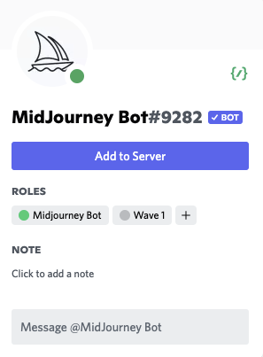 prompt: **`vibrant california poppies --stop 50`**

#### --Uplight

`--uplight` Use "lighter" upscaler for upscales. Light results are closer to the original image with less detail added during upscale. `--uplight` corresponds to the  button in `/settings`.


  

Regular upscale  (left)  vs Light Upscale  (right)


### Seeds&#x20;

A seed number generate the random starting noise used in the begining of image generation. Using the same number across multiple prompts will use the same starting noise.

#### --Seed

`--seed` Sets the random seed (an integer), which can sometimes help keep things more steady / reproducible between generations.

 

`/imagine prompt: an abstract field of flowers` run twice without a seed.


 

`prompt:`**`vibrant california poppies`**` ``--seed 0987` run twice.&#x20;

#### --Sameseed

`--sameseed <number>` Sets the same seed across all images of the resulting grid, resulting in minimal changes within the initial grid. The `sameseed` can be any positive integer.

&#x20;

`prompt:`**`vibrant california poppies`**` ``--sameseed 0987`

### --Stylize

`--stylize <number>`, or `--s <number>` The stylize argument sets how strong of a 'stylization' your images have, the higher you set it, the more opinionated it will be. Default number is 2500.&#x20;

See the [User Manual](user-manual.md#stylize-values) for more detailed information.

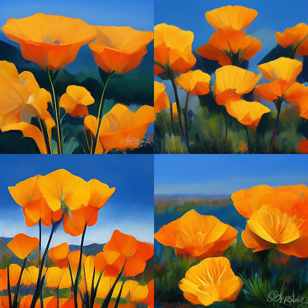

`--s 1250` Good for when you want it to be 'less strict' but still 'pretty' (this is probably recommended for skilled users). \
`--s 1250` corresponds to the  button in `/settings.`

``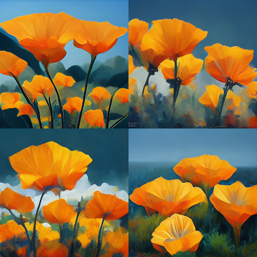

`--s 2500` Good for when you want it to be 'less strict' but still 'pretty' (this is probably recommended for skilled users). \
`--s 2500` corresponds to the  button in `/settings.`

``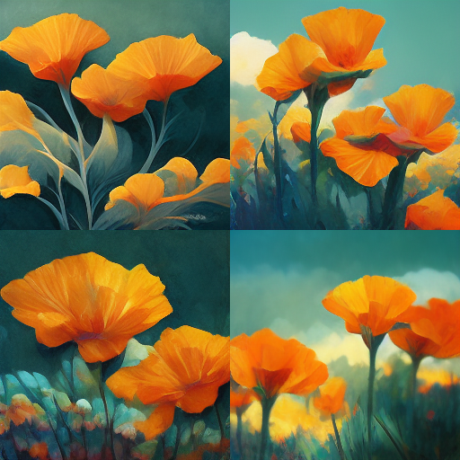``

`--s 5000` corresponds to the  button in `/settings.`&#x20;

``

``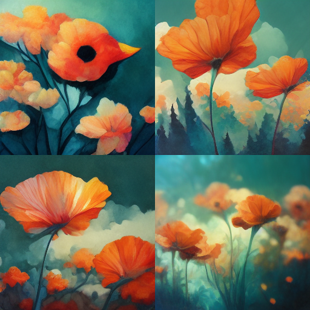``

`--s 20000` If you want it to 'take over' and start drifting from your text, but not go crazy. \
`--s 20000` corresponds to the  button in `/settings.`


### --Quality

`--quality <number>` , or `--q <number>` Sets how much rendering quality time you want to spend. Default number is 1. Higher values take more time and cost more\
See the [User Manual](user-manual.md#quality-values) for more detailed information.

``

``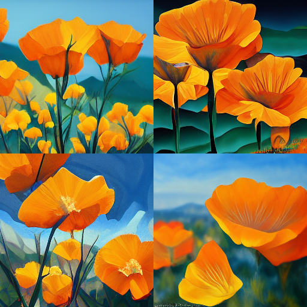``

`--q .5` Rougher results, 2x faster / cheaper. \
`prompt:`**`vibrant california poppies --q .5`**\
**``**`--q .5` corresponds to the  button in `/settings.`

``

**``****``**

`--q 1` The **default value**, you do not need to specify it.\
**``**`prompt:`**`vibrant california poppies`**\
**``**`--q 1` corresponds to the  button in `/settings.`

``

````

`--q 2` The **default value**, you do not need to specify it.\
**``**`prompt:`**`vibrant california poppies --q 2`**\
**``**`--q 2` corresponds to the  button in `/settings.`

### ``

### `Progress Videos`

`--video` Saves a progress video. Video will be sent to you in DM by the bot (private message) after you react to the result with the ✉️ emoji.

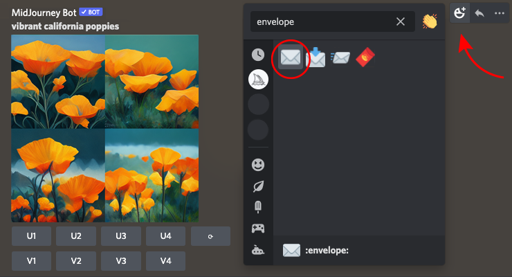

### Image Prompting with URL

`--iw` Sets image prompt weight proportional to the text weight. Use a decimal value (default 0.25).&#x20;

Add one or more image URLs to your prompt and it will use those images as visual inspiration. You can mix words with images or just have images alone. See [Image Prompt Questions](FAQs.md#image-prompt-questions) for more info.

**Note**: This is _not_ the same as building on top of (or "initializing" from) an input image. Midjourney does not currently offer the ability to use an "init" image as seen in some other tools, due to concerns about community public content.

`--iw` — Adjusts the weight of the image URLs vs the text. 0.25 is the default weight. As you increase it to 1, you increase the strength of the image. Experiment and see what you like. Also [see FAQ here](FAQs.md#image-prompt-questions) and [Manual section here.](user-manual.md#image-prompting-with-url)

**Note**: There is currently no way to apply different weights to different image prompts. This will be addressed in the future.

Example image prompt:

.png>) Linked Image with the URL "https://dots.jpg"


Image prompt use with no `--iw` parameter, `--iw .5`  `--iw 1` `--iw 2` and `--iw 5`

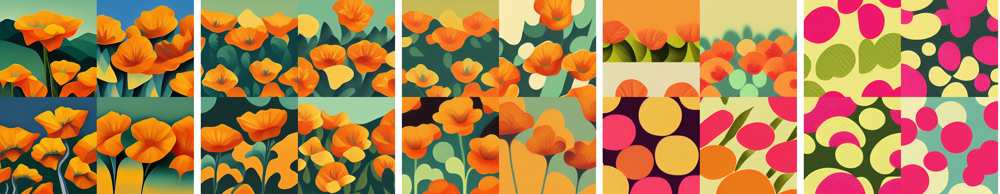

**From left to right:**

* `prompt`` `**`https://dots.jpg vibrant california poppies`** (default image weight is .25)
* `prompt`` `**`https://dots.jpg vibrant california poppies --iw .5`**&#x20;
* `prompt`` `**`https://dots.jpg vibrant california poppies --iw 1`**&#x20;
* `prompt`` `**`https://dots.jpg vibrant california poppies --iw 2`**&#x20;
* `prompt`` `**`https://dots.jpg vibrant california poppies --iw 5`**&#x20;


### Settings

You can use the `/settings` command to set parameters you want to use as your defaults.\
Each row is a toggle button, meaning turning one on will turn the others off.&#x20;


