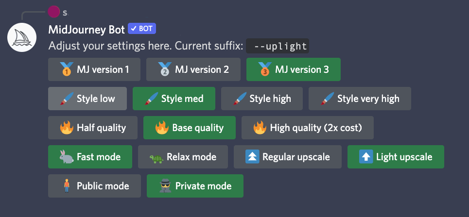

# User Manual

Please make sure you are familiar with the content guidelines and are aware of what is public content in the community. You can find more detail in [Content and Moderation](content-and-moderation-policy.md). This document does not cover everything in the[ official Midjourney Discord server](https://discord.gg/midjourney) (#rules, #faq, #announcements, #status channels), so make sure you check it out along with the other pages in this documentation, such as [Frequently Asked Questions](FAQs.md) and [Resource Links](resource-links/).

That said, enjoy creating beautiful images! In this page:

* [Basic Commands in Bot Channels](user-manual.md#basic-commands-in-bot-channels)
* [Parameters to "/imagine"](user-manual.md#parameters-to-imagine)
* [Stylize Values](user-manual.md#stylize-values)
* [Quality Values](user-manual.md#quality-values)
* [Emoji Reactions to Generation Output](user-manual.md#emoji-reactions-to-generation-output)
* [Image Prompting with URL](user-manual.md#image-prompting-with-url)
* [Advanced Text Weights](user-manual.md#advanced-text-weights)
* [Prompt Preferences and Settings](user-manual.md#prompt-preferences-and-settings)
* [Deprecated: May Want To Avoid](user-manual.md#deprecated-may-want-to-avoid)

### Basic Commands in Bot Channels

Commands are functions of the Midjourney bot that can be typed in any bot channel or thread under a bot channel. A bot channel is a channel under the "Image Generation" section on the Discord server.

`/imagine` creates an image based on the `prompt` text you provided. It produces a grid of 4 images, taking around 50 seconds with default settings.

`/help` displays universally helpful information and tips about the Midjourney bot.

`/info` shows information about your profile, plan, usage, and currently running jobs.

`/subscribe` creates a unique link to the subscription page of your current Discord account, without needing to sign in on the website.

`/fast` and `/relax` toggles between "fast" and "relax" mode. In fast mode, if you are out of jobs, your jobs will be incrementally billed. In relax mode, your jobs do not cost, but take longer to generate. Only active Standard and Corporate plans have access to relax mode.

`/show <jobid>` after recovering the ID of a job in your gallery, you can summon that job again in the chat, producing the resulting image and upscale+variation buttons. This allows you to essentially revive any job you generated yourself, bringing it into any bot channel to generate upscales and variations there, even if you have lost access to the original message.

`/private` and `/public` toggle between "private" and "public" mode. In private mode, your jobs are only visible to you. **In public mode, your jobs are visible to everyone in the gallery, even if you are creating them in a thread or a DM.** Access to private mode costs an extra 20$ per month.

You can find more documentation on using these in our [FAQs](FAQs.md).

### Parameters to "/imagine"

Parameters are "inputs" to the command.  Some are required, like a prompt, others are optional and will change how the prompt is interpreted and the image is created.

For instance, a full imagine command might contain several things, like an image URL, some weights, other switches:

`/imagine prompt: http://myimageonline.jpg A forest spirit at night --iw 0.2 --no trees --hd`

Below are some of the "switches" you can add at the end of the command, using the "--" delimiter.

`--hd` Uses a different algorithm that’s potentially better for larger images, but with less consistent composition. Best for abstract and landscape prompts. This also generates images at higher resolutions without the need to upscale.

`--w` Width of image. Works better as multiples of 64 (or 128 for `--hd`)

`--h` Height of image. Works better as multiples of 64 (or 128 for `--hd`)

`--aspect`, or `--ar` Sets the desired aspect ratio, instead of manually setting height and width with `--h` and `--w`. Try `--ar 16:9` for example, to get a 16:9 aspect ratio (\~448x256).

Size shortcuts for common resolutions

These are synonyms for longer commands.  In other words, using `--wallpaper` is the same as saying   `--w 1920 --h 1024 --hd`.

`--wallpaper`: `--w 1920 --h 1024 --hd`

`--sl`: `--w 320 --h 256`

`--ml`: `--w 448 --h 320`

`--ll`: `--w 768 --h 512 --hd`

`--sp`: `--w 256 --h 320`

`--mp`: `--w 320 --h 448`

`--lp`: `--w 512 --h 768 --hd`

You can see an illustrated guide to all these parameters on [this page](imagine-parameters.md).  You can read more about image sizes and how to interpret them on [Understanding Image Size](resource-links/understanding-image-size.md).

`--seed` Sets the seed, which can sometimes help keep things more steady and reproducible when trying to generate a similar prompt again. It must be a positive integer (e.g. 2, 534, 345554). If not used, a random seed will be chosen instead, behind the scenes. You can react with :envelope: to a job's message to know what seed value was used.

`--sameseed` Makes it so the seed affects all images of the resulting grid in the same way. If not used, each image in the grid will use a different "slice" of the seed, providing higher variety.

`--no` Negative prompting (`--no plants` would try to remove plants). Equivalent to using an [advanced text weight](user-manual.md#advanced-text-weights) of `::-0.5`

`--iw` Sets image prompt weight relative to text weight. Default value is `--iw 0.25`

`--stylize <number>`, or `--s <number>` The stylize argument sets how strong of a 'stylization' your images have, the higher you set it, the more opinionated it will be. Default value is 2500. [See below](user-manual.md#stylize-values) for more info.

`--quality <number>` , or `--q <number>` How much rendering quality time you want to spend. Default value is 1. Higher values cost more and lower values cost less, [see below](user-manual.md#quality-values).

`--fast` Faster images, less consistency, less expensive. You can also use `--q 0.5` and `--q 0.25` for a similar result, [see below](user-manual.md#quality-values).

`--stop` Stop the generation at an earlier percentage. Must be between 10-100. This currently does not work with upscales.

`--video` Saves a progress video, which is sent to you in the ✉️-triggered DM (you must react with the envelope to get the video link). This currently does not work with upscales.

`--version <1 or 2>` or `--v <1 or 2>`  Uses old algorithms 1 (which was formerly the "vibe" option, sometimes better for macro or textures) or 2, the last improvement.  We are at 3 now, which you do not need to specify.  So specify `--version 2` to use the previous older model, or `--version 1` for the one before.

`--uplight` Uses the "light" upscaler when selecting the `U` **** buttons. Results are then closer to the original image, with less detail added during upscale. Ideal for faces and smooth surfaces.

### Stylize Values

These can all be used with the shortcut version `--s` instead.

`--stylize 625` If you basically want to turn it off and be less artistic.

`--stylize 1250` Good for when you want it to be 'less strict' but still 'pretty' (this is probably recommended for skilled users).

`--stylize 2500` The **default value**, so you don't have to specify this.

`--stylize 20000` If you want it to 'take over' and start drifting from your text, but not go crazy.&#x20;

`--stylize 60000` Hands off the wheels, who knows what will happen. It may look nothing like your prompt.

### Quality Values

The shortcut version is `--q`.

`--quality 0.25` Rough results, 4x faster / cheaper.&#x20;

`--quality 0.5` Less detailed results but 2x faster / cheaper.

`--quality 1` The **default value**, you do not need to specify it.

`--quality 2` More detailed results, but 2x slower and 2x the price (2 minutes per image).&#x20;

~~`--quality 5` kind of experimental, 'might' be more creative or detailed (also might be worse!) (5 minutes per image).~~    **Temporarily Disabled!**

### Emoji Reactions to Generation Output

"React" to a generation with various emojis to trigger actions from the bot.

✉️ `:envelope:` The envelope emoji reaction sends an image to your DMs with the seed # and job ID. If the result was a grid, it will send each individual image. You may have to hunt for this emoji by typing "envelope" in your emoji list.

⭐️ `:star:` Marks image as "favorite". This shows in a separate feed on the web gallery and sends the image to the #favorites channel.

❌  `:x:` Cancels or deletes a generation at any time. It is also removed from the web gallery. Please help us by removing content you accidentally generated that is in violation of our PG-13 content guidelines (see [Content and Moderation](content-and-moderation-policy.md)).

### Image Prompting with URL

Add one or more image URLs to your prompt and it will use those images as visual inspiration. You can mix words with images or just have images alone. For more info see [Image Prompt Questions](FAQs.md#image-prompt-questions) and watch the video below for a demonstration on how to upload and use an image.

`--iw <value>` Adjusts the weight of the image URLs vs the text. They default to 0.25.  Experiment and see what you like. For example, `--iw 1` makes your image URL just as important, for the generation, as your default-weight prompt text. Also see [FAQ here](FAQs.md#image-prompt-questions).


There is currently no way to apply different weights to different image prompts. This will be addressed in the future.


#### Is there a way to edit my images with Midjourney?

Image Prompting is _not_ the same as building on top of (or "initializing" from) a starting input image as you may see in other generation tools. Midjourney does not currently offer the ability to use a starting image, due to concerns about community public content. Instead, we let you use an image as inspiration, usually with text, to guide the generation.

### Advanced Text Weights

You can suffix any part of the prompt with `::0.5` to give that part a weight of 0.5. If the weight is not specified, it defaults to 1. See also [Text Prompt Questions](FAQs.md#text-prompt-questions).

Some examples:

* `/imagine hot dog::1.5 food::-1` — This sends a text prompt of `hot dog` with the weight 1.5 and `food` of weight -1
* `/imagine hot dog::1.25 animal::-0.75` — Sends `hot dog` of weight 1.25 and `animal` of negative 0.75
* `/imagine hot dog:: food::-1 animal` — Sends `hot dog` of weight 1, `food` of weight -1 and `animal` of weight 1

Prompts with a negative total weight are not allowed.


The "--no" command is equivalent to using a text weight of "-0.5".  For instance, "--no farms" means don't include farms in the output, same as "farms::-.5"


### Prompt Preferences and Settings

`/settings` — This will give you some buttons to view and change your current preferences, like the `/prefer suffix` command but visually.  Each set of preferences is a toggle, meaning turning one on will turn the others off.&#x20;

What each <code>/settings</code> button means

#### Older versions of the Midjourney algorithm:

* _MJ version 1_ sets the `--v 1` suffix&#x20;
* _MJ version 2_ sets the `--v 2` suffix&#x20;
* _MJ version 3_ doesn't set any suffix: this is the default value and the current version of our tool

#### How much stylistic control you want to hand over to Midjourney:

* _Style low_ sets the `--s 1250` suffix. If you want even less, set `--s 625` with `/prefer suffix` instead
* _Style med_ doesn't set any suffix: this is the default value
* _Style high_ sets the `--s 5000` suffix&#x20;
* _Style very high_ sets the `--s 20000` suffix. If you want even more, set `--s 60000` with `/prefer suffix` instead

#### How much more or less detailed and expensive you want your jobs to be:

* _Half quality_ sets the `--q 0.5` suffix. This is less detailed 1/2 as expensive
* _Base quality_ doesn't set any suffix: this is the default value
* _High quality_ sets the `--q 2` suffix. This is more detailed and 2x as expensive

#### Switching between `/fast` and `/relax` mode ([more info](https://midjourney.gitbook.io/docs/faqs#fast-and-relaxed)):

* _Fast mode_ is equivalent to using the `/fast` command
* _Relax mode_ is equivalent to using the `/relax` command

#### Upscaling images with or without added detail:

* _Regular upscale_ doesn't set any suffix: this is the default value
* _Light upscale_ sets the `--uplight` suffix. This causes the **U** buttons to upscale your image while keeping the original detail mostly intact

#### Switching between `/public` and `/private` mode ([more info](https://midjourney.gitbook.io/docs/billing#private-visibility-option-+usd20-month)):

* _Public mode_ is equivalent to using the `/prublic` command
* _Private mode_ is equivalent to using the `/private` command

`/prefer suffix <text>` — This will automatically append the specified suffix after all prompts you submit. Leave empty to reset.


Only "--" options are currently officially supported as values for prefer suffix, not just any regular text. For example, you can use "--uplight" and "--no golden hour", while "soft" or "golden hour::-0.5" will not work.


`/prefer auto_dm True` — Jobs will be automatically DMed to you. Set False to turn this off.

`/prefer option set <name> <value>` — This creates a personal option, which then translates to the value you have set when you invoke it by prepending it with `--`. Only you can use this option. For example, `/prefer option set mine --hd --w 512` creates an option called "mine" that translates to `--hd --w 512`. So you can use `/imagine rubber ducks are awesome --mine`, and it will be the exact same as if you did `/imagine rubber ducks are awesome --hd --w 512`. Leave the "value" field empty to delete an option.

`/prefer option list` — This will list the personal options you've currently set with the `/prefer option set` command. You may keep a maximum of 20 personal options.

### Deprecated: May Want To Avoid

`--hq` `--newclip` `--nostretch` `--beta` `--old` `/pixels` `/idea`
